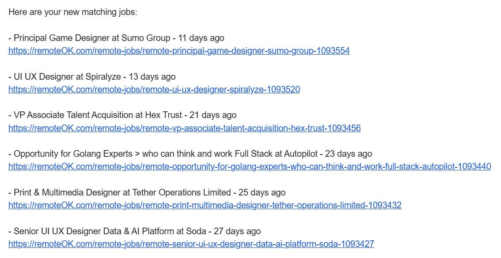

# 📄 RemoteOK Job Scraper

A Python script to fetch remote design-related job listings from [RemoteOK](https://remoteok.com), filter them by keywords, store them in Google Sheets, and send you an email digest.

Cron job-ready once you set up all your credentials and install the appropiate dependencies on your server.

---

## 🚀 Features

- Fetches jobs from RemoteOK's public API
- Filters listings by desired and undesired keywords
- Saves results to a Google Sheet
- Sends matching job listings to your email
- Avoids duplicates using a local JSON database
- Includes timestamp parsing with timezone awareness

---

## 🛠 Requirements

Install dependencies with:

```bash
pip install requests gspread oauth2client yagmail pytz
```

---

## 📦 Setup

1. **Google Sheets Setup**  
   - Create a Google Cloud project with the Sheets API enabled  
   - Generate a Service Account JSON key file  
   - Share your Google Sheet with the service account email  
   - Save the credentials JSON and note the path (used below)

2. **Environment Configuration**  
   Edit the following fields in `job_scraper_cleaned.py`:

```python
GOOGLE_SHEET_NAME = '[YOUR_GOOGLE_SHEET_NAME_HERE]'
EMAIL_TO = '[YOUR_EMAIL_HERE]'
local_tz = pytz.timezone('[YOUR_TIMEZONE_HERE]')  # e.g., 'America/New_York'
```

3. **Email Configuration (Gmail)**  
   Use an App Password if 2FA is enabled:

```python
yag = yagmail.SMTP('[YOUR_GMAIL_USERNAME_HERE]', '[YOUR_APP_PASSWORD_HERE]')
```

---

## 📅 Timezone Notes

Make sure to set your correct timezone in this line:

```python
local_tz = pytz.timezone('[YOUR_TIMEZONE_HERE]')
```

Refer to the [pytz timezone list](https://en.wikipedia.org/wiki/List_of_tz_database_time_zones) for valid options.

---

## ▶️ Running the Script

You can run the script manually:

```bash
python job_scraper_cleaned.py
```

Or schedule it via a cron job or task scheduler for periodic checks.

---

## 💡 Customization

### Filtering Keywords
Modify these keyword lists in the script to control matching logic:

```python
INCLUDE_KEYWORDS = ['ui', 'ux', 'designer', 'web designer', 'unity', ...]
EXCLUDE_KEYWORDS = ['developer', 'engineer', 'backend', ...]
```

---

## 📁 Output

Matching jobs are:
- Appended to your Google Sheet
- Emailed in a readable format
- Logged with timestamps (with time-ago formatting)

---

## 🧠 Note

This project is for personal use, demo, or extension. Always respect third-party API usage limits and terms of service.

---

## 📬 License

MIT License

---


---

## 🖼 Example Screenshots

Here’s what a matching job digest might look like in your email:

